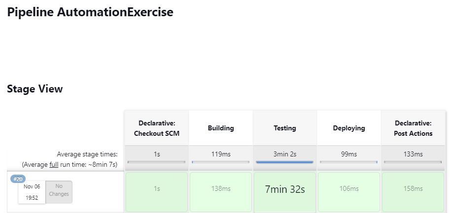
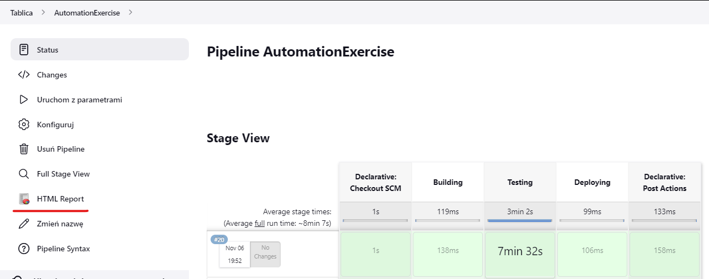
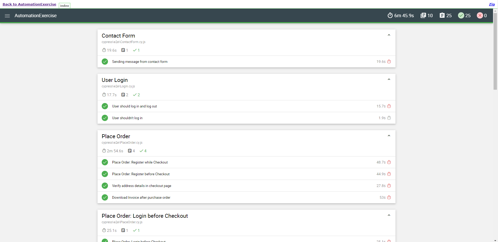

# Automation-exercise-e2e-cypress-tests

E2E tests using Cypress for https://www.automationexercise.com/.

Test Cases - https://www.automationexercise.com/test_cases

# How to run the tests

1. Clone the repository
2. Run `npm install`
3. Run `npm run cy:run`

# Using Faker (https://fakerjs.dev/) to generate the data needed for registration

Running RegisterUser.cy.js test will invoke method `generateRegisterFixture()` that will generate random data and save it to the `fixtures` folder as `registerData.json`. The user will be registered based on this data.

```javascript
Cypress.Commands.add("generateRegisterFixture", () => {
  cy.writeFile("cypress/fixtures/registerData.json", {
    userName: `${faker.internet.userName()}`,
    email: `${faker.internet.email()}`,
    password: `${faker.internet.password()}`,
    dayOfBirth: `${faker.datatype.number({ min: 1, max: 27 })}`,
    monthOfBirth: `${faker.date.month()}`,
    yearOfBirth: `${faker.datatype.number({ min: 1950, max: 2012 })}`,
    firstName: `${faker.name.firstName()}`,
    lastName: `${faker.name.lastName()}`,
    company: `${faker.company.companyName()}`,
    addressFirstLine: `${faker.address.streetName()}`,
    addressSecondLine: `${faker.address.secondaryAddress()}`,
    state: `${faker.address.state()}`,
    city: `${faker.address.city()}`,
    zipcode: `${faker.address.zipCode()}`,
    phoneNumber: `${faker.phone.number()}`,
    cardNumber: `${faker.finance.creditCardNumber()}`,
    cvvCardNumber: `${faker.finance.creditCardCVV()}`,
    expirationMonth: `${faker.datatype.number({ min: 1, max: 12 })}`,
    expirationYear: `${faker.datatype.number({ min: 2022, max: 2040 })}`,
  });
});
```

# Running tests on Jenkins and displaying a HTML report







HTML Report is updated after each test